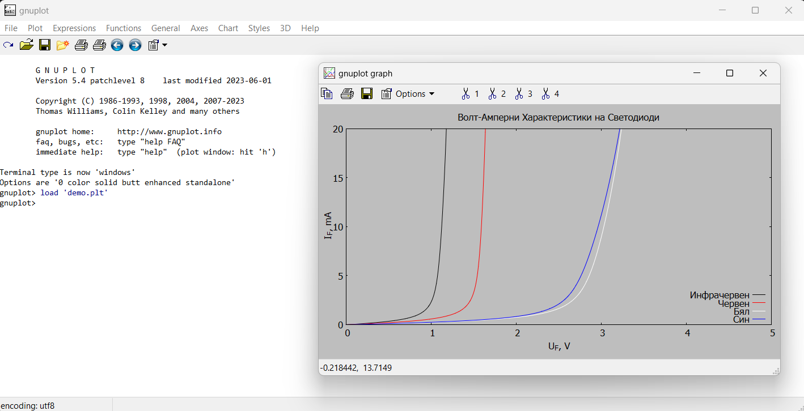
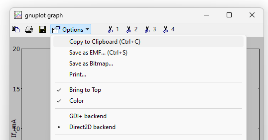

# Изчертаване на данните от лабораторните измервания с [GnuPlot](https://sourceforge.net/projects/gnuplot/files/gnuplot/)

## Инсталиране
Даунлоадвайте [GnuPlot](https://sourceforge.net/projects/gnuplot/files/gnuplot/) и го инсталирайте на вашият компютър.

## Описание на файловете
Файловете с разширение `.plt` съдържат команди за изчертаване на графиката.
Измерените стойности трябва да бъдат копирани в съответният `.dat` файл.
И двата типа файлове са текстови и трябва да се редактират с подходящ редактор - например Notepad или още по-добре [Notepad++](https://notepad-plus-plus.org/downloads/)

### Диоди
* V-A характеристики на диоди - право включване: `diod-f.plt, diod-f.dat`
* V-A характеристики на диоди - обратно включване: `diod-r.plt, diod-r.dat`
* V-A характеристики на ценерови диоди - право включване: `zener-f.plt, zener-f.dat`
* V-A характеристики на ценерови диоди - обратно включване: `zener-r.plt, zener-r.dat`
* V-A характеристики на светодиоди: `led.plt, led.dat`
Забележка: за светодиодите се налага да редактирате `led.plt` за да смените цветовете на графиките, така че да съответстват на версията на проекта ви.

### Биполярни транзистори
* 

### MOS транзисотри
*

## Процедура за изчертаване

* Уверете се, че в данните са използвани десетични точки (а не запетайки)!
* В директорията GnuPlot намерете файловете за графиката, която ще изчертаете - например led.plt и led.dat. 
* Копирайте таблицата от Google Docs в Google Sheets и след това във текстовият DAT файл - например led.dat. Преминаването през Google Sheets се налага за да се запази табличната структура.
* Стартирайте GnuPlot и заредете PLT файла - например led.plt.
* Копирайте получената графика в клипбоарда и я поставете в отчета.

## Пример
За демонстрация ще използваме файловете [demo.plt](demo.plt) и [demo.dat](demo.dat).

Стартирайте GnuPlot и заредете файла demo.plt

`File > Open > demo.plt`

Копирайте графиката с 

`Options > Copy to Clipboard`

И я поставете в Google Docs

