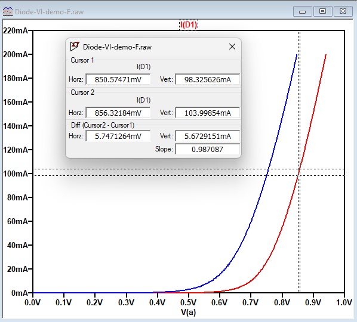

# LTSpice - Измерване на диференциално съпротивление

Диференциалното съпротивление се дефинира като отношение на промяна на напрежените към съответната промяна на тока. За болшинството волт-амперни характеристики на полупроводникови прибори, диференциалното съпротивленние е различно в отделните точки.

По-долу е разгледан пример за измерване на диференциално съпротивленни на диод в право включване. Същата методика се използва и за всяка друга волт-амперна х-ка.

## Задача
Използвайте резултатите от симулацията за да определите диференциалното съпротивление rd в право включване, при If=100mA и Т=25C.

1. Добавете и двата курсора на LTSpice към графиката - щракнете с десния клавиш на мишката върху името на графиката I(D1).

2. Позиционирайте първият курсор малко над 100mA, а втория - малко под 100mA. 

За да преместите курсор, кликнете с мишката върху него и драгвайте. За да преминете между графиките, използвайте стрелките "нагоре" и "надолу" от клавиатурата.

Разликите между координатите на двата курсора ви дават измененията на напрежението и тока, които трябва да разделите за да се получи диференциалното съпротивление.

rd = 5.74mV / 5.67mA = 1.01 kOhm
